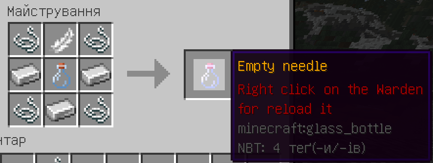
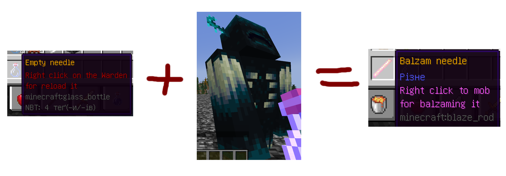
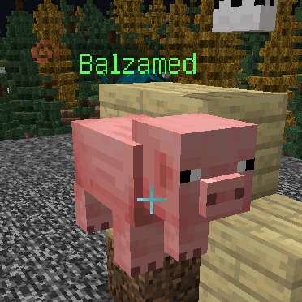
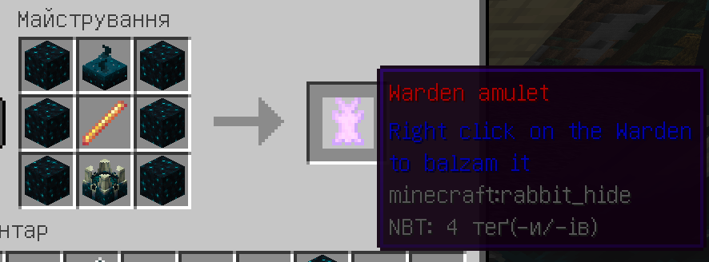
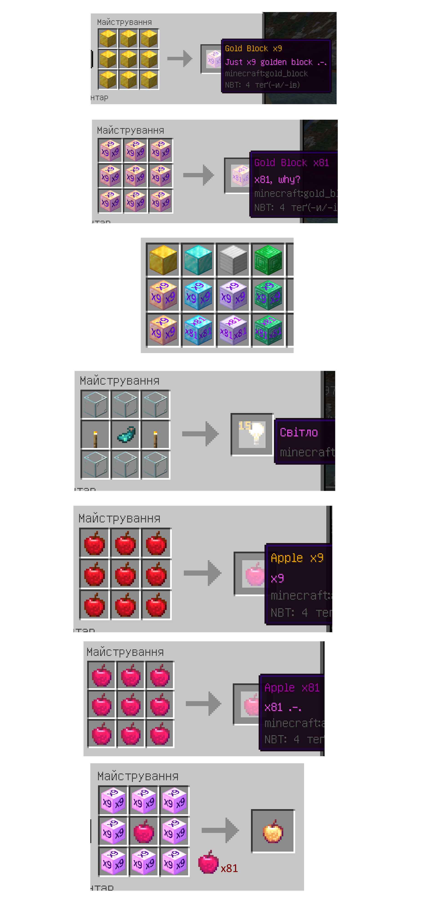
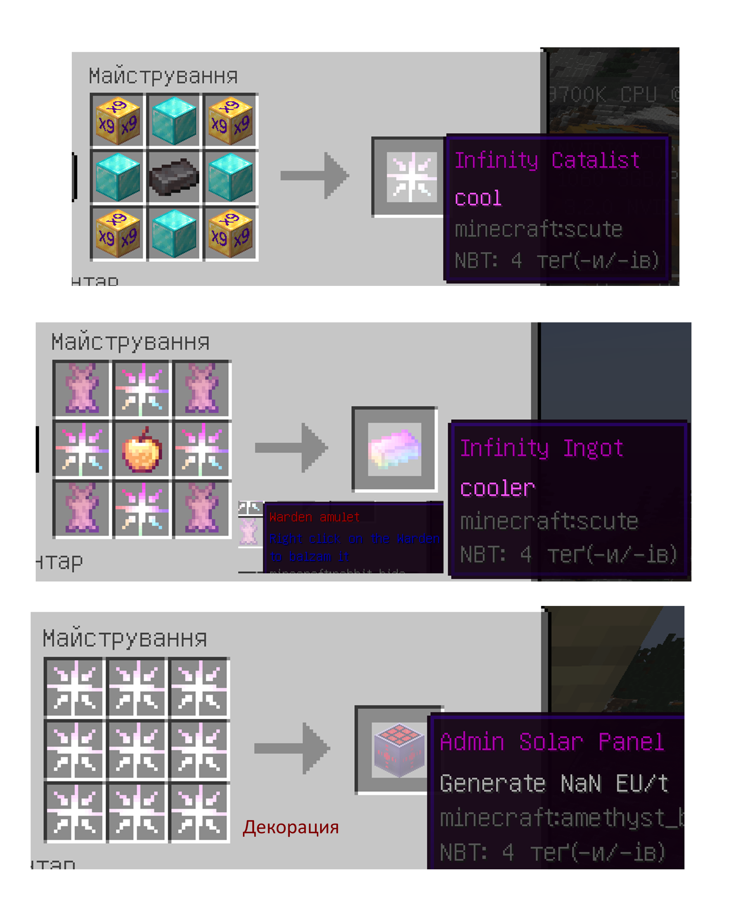
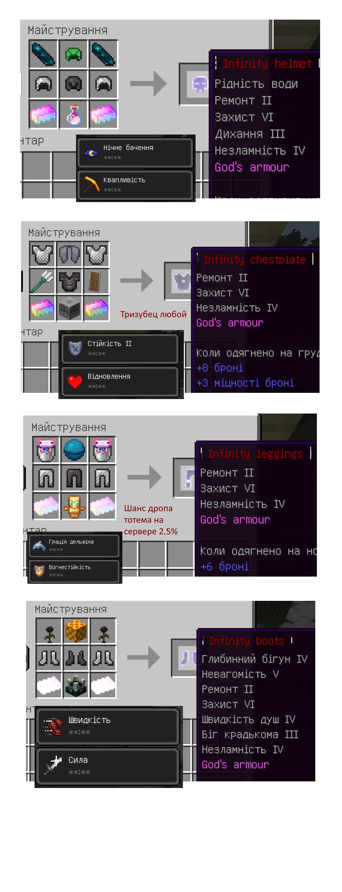

  

<h1 align="center">Установка и настройка Майнкрафта</h1>

___

## Зміст

[1. CustomTextures](#a1)

[2. ThiefPlugin](#a2)

[3. CustomSounds](#a3)

[4. BalzamingMobs](#a4)

[5. CustomCrafts](#a5)

[5.1 Infinity Set](#a6)

## 1. CustomTextures
Вещи можно получить при выигрыше в ивентах

`Тутор напишу, ближе к ивенту`

## 2. ThiefPlugin
Вещи можно получить при выигрыше в ивентах

`Тутор напишу, ближе к ивенту`

## 3. CustomSounds
Вещи можно получить при выигрыше в ивентах

`Тутор напишу, ближе к ивенту`

## 4. BalzamingMobs

- С помощью этого плагина вы сможете бальзамировать мобов.
  Для этого мы сначала крафтим пустой шприц:

- Теперь мы должны набрать магической жижки из сердца Вардена. Для этого мы
  кликаем ПКМ по Вардену, чтобы наполнить шприц жижкой.

- **Пометка**: Если Варден забальзамирован, то его нельзя использовать в таких целях

- Теперь мы получили шприц, который можно использовать. Если таким шприцом мы нажмем по мобу, то этот моб
  забальзамируется, он не сможет ходить, атаковать, получать урон и тому подобное, и сверху появится зеленое слово `Balzamed`.
  Если же кликнуть по этому мобу лазуритом, то бальзамация пройдет, и моб станет таким, как и был до этого.

- **Пометка**: Можно забальзамировать всех, кроме эндер-дракона, визера и самого Вардена.

- Если же мы хотим забальзамировать Вардена, то нам нужно сделать для этого амулет:

`Этот амулет придумали шаманы и Юкку, сидя в пещере. Он действует только на Вардена, а также поговаривают, что его
используют в крафте брони богов.`

## 5. CustomCrafts

Вот основные крафты, которые этот плагин добавляет:

## 5.1 Infinity Set

**Пометка**: Для крафта Инфинити сета потребуется вещи из плагина `BalzamingMobs`

[(Ссылка на плагин)](#a10)

**Пометка**: Для нормального отображения Инфинити Сета требуется `OptiFine`

**Пометка**: Инфинити сет, при надевании, дает постоянные эффекты своему хозяину, о которых будет расписано потом.

