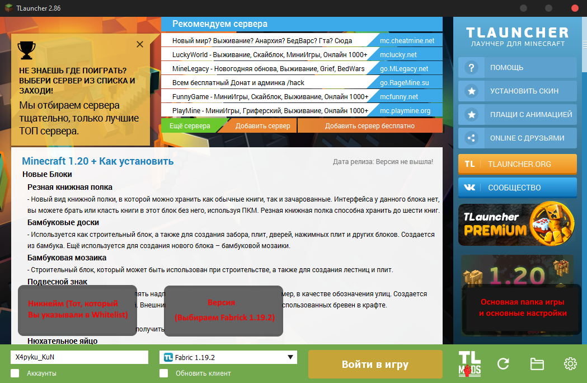
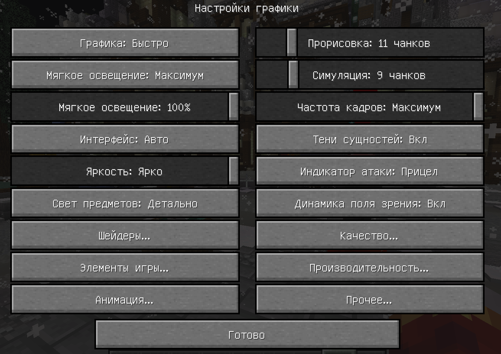
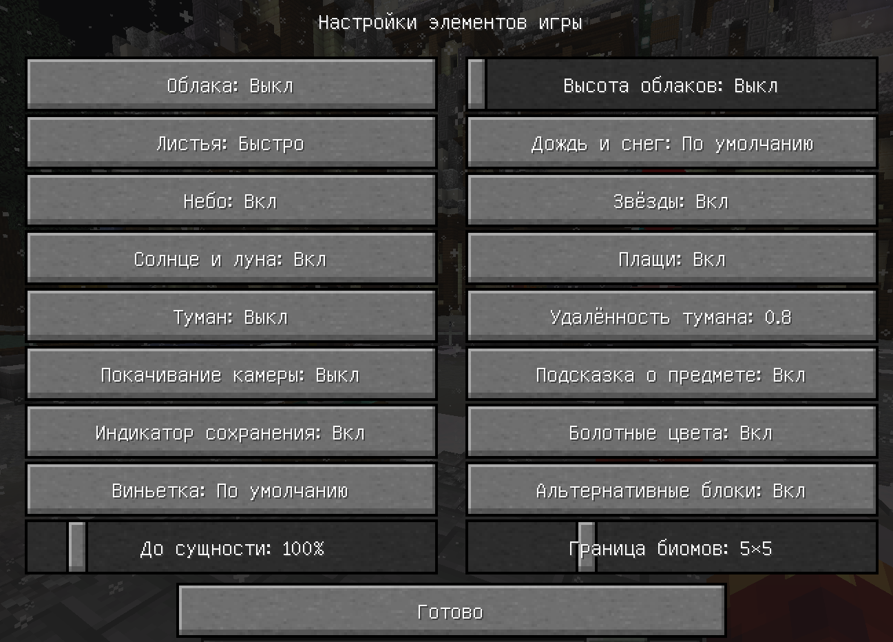
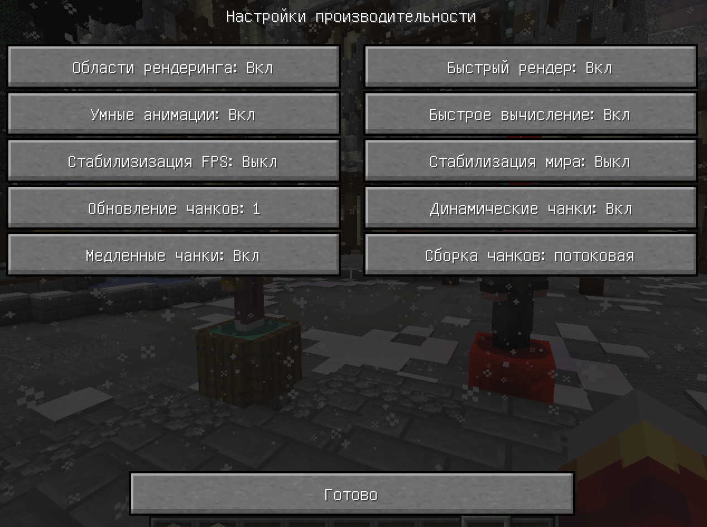
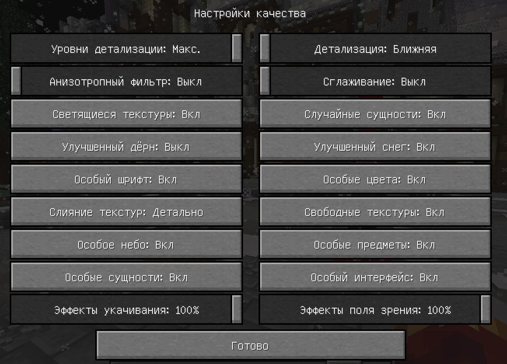

  

<h1 align="center">Установка и настройка Майнкрафта</h1>

___

## Содержание

[1. Скачивание лаунчера](#a1)

[2. Скачивание Оптифайна](#a2)

[3. Оптимизация Майнкрафта (.-.)](#a3)

## 1. Скачивание лаунчера
___
### 1.2 Скачивание Пиратки

Заходим на сайт [Tlauncher](https://tlauncher.org/) . Скачиваем инсталлятор и запускаем.
Основные настройки TLauncher'a:

Переходим в Дополнительные настройки (в лаунчере справа снизу шестерня) и внизу выставляем
ползунком объем выделенной оперативной памяти.

**Совет:** Ставьте оперативную память, но так, чтобы у вас были свободные 3 ГБ.
Например, у Вас стоит 16 ГБ => на майн максимально можно будет выделить 13 ГБ.

## 2. Скачивание Оптифайна
___

Оптифайн нам нужен для оптимизации Майнкрафта и корректной работы
ресурс пак сервера. Этот метод позволяет увеличить производительность до двух раз
(Больше фпс). Поэтому сейчас его скачаем.

Переходим по ссылке, и скачиваем 2 файла для Оптифайна.

[Гугл диск](https://drive.google.com/drive/folders/1h0L_ZUJxBb6npJZFBZ4G_XYUCRb61Yaz?usp=sharing)

Теперь открываем основную папку (в лаунчере справа внизу папка нарисована)
Переносим 2 файла в нашу в папку "mods". Под конец, в папке должно оказаться два файла.
в `C:\Users\User\AppData\Roaming\.minecraft\mods\Optifine.jar`
Для проверки, что все сработало, заходим в майнкрафт, и нажимаем F3, у вас
будет отображаться два типа ФПС: средний и текущий. Также, при нажатии "С" кнопки,
в нас будет срабатывать приближение. Если все это есть, то поздравляю, вы установили Optifine!

### 3. Оптимизация Майнкрафта
___
`Если вы уже мать Юзер Майнкрафта, то этот пункт можно пропускать  `

Ставим Русский язык: ESC => settings => language => Листаем почти
полностью вниз, там будет Русский.
Нажимаем Done. Теперь настроим графическую часть:

Нажимаем ESC => Настройки => Настройки графики. Оказываемся в таком меню:

Теперь пройдемся по основным вкладкам:

### Элементы игры:

### Производительность:

### Анимация:

` Если у вас не самое сильное железо, то исключаем все в этом пункте
(Все Выключу). В противном случае, здесь все ставим на свой вкус
(Этот пункт сильно влияет на производительность)`

### Качество:

