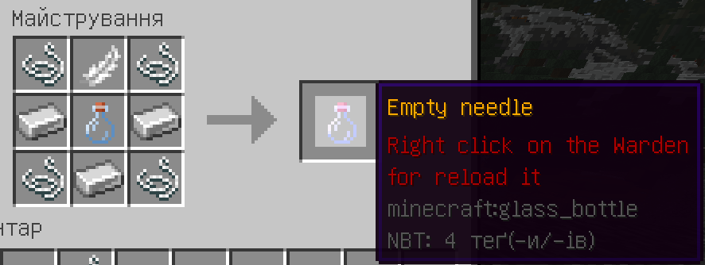
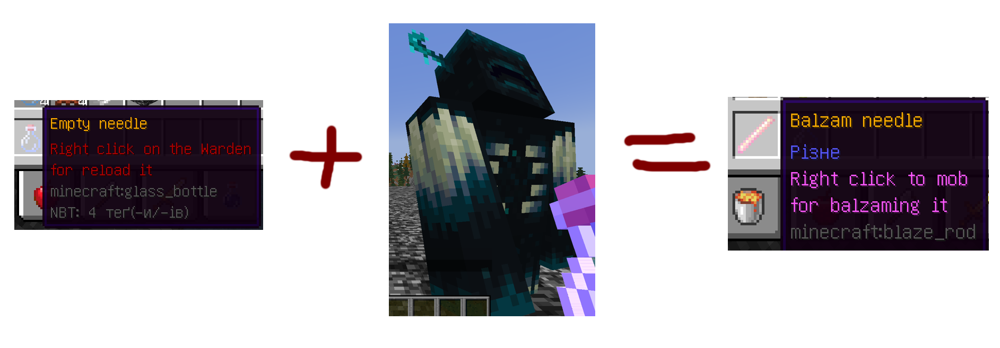
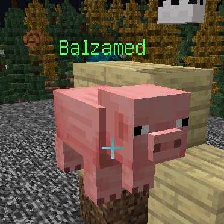
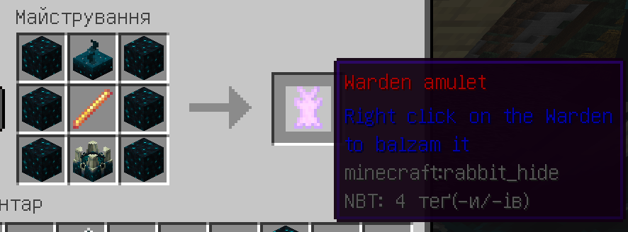
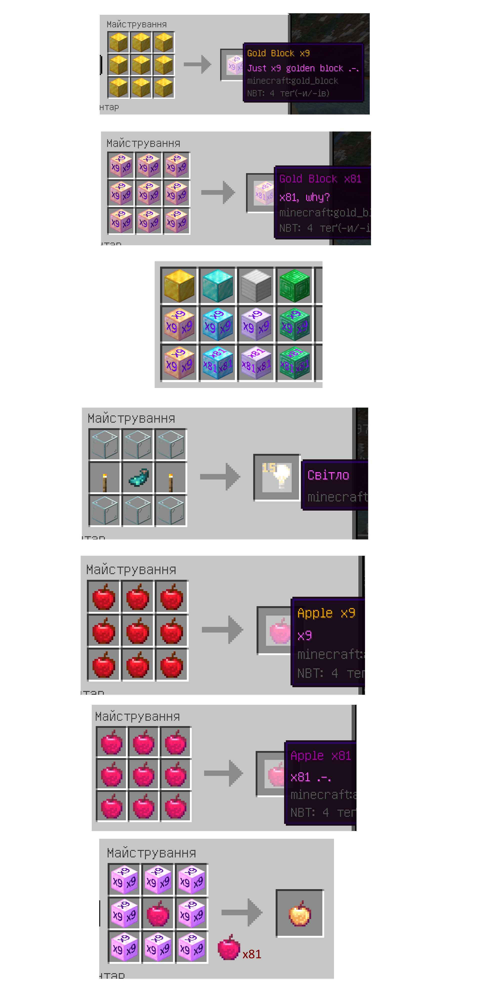
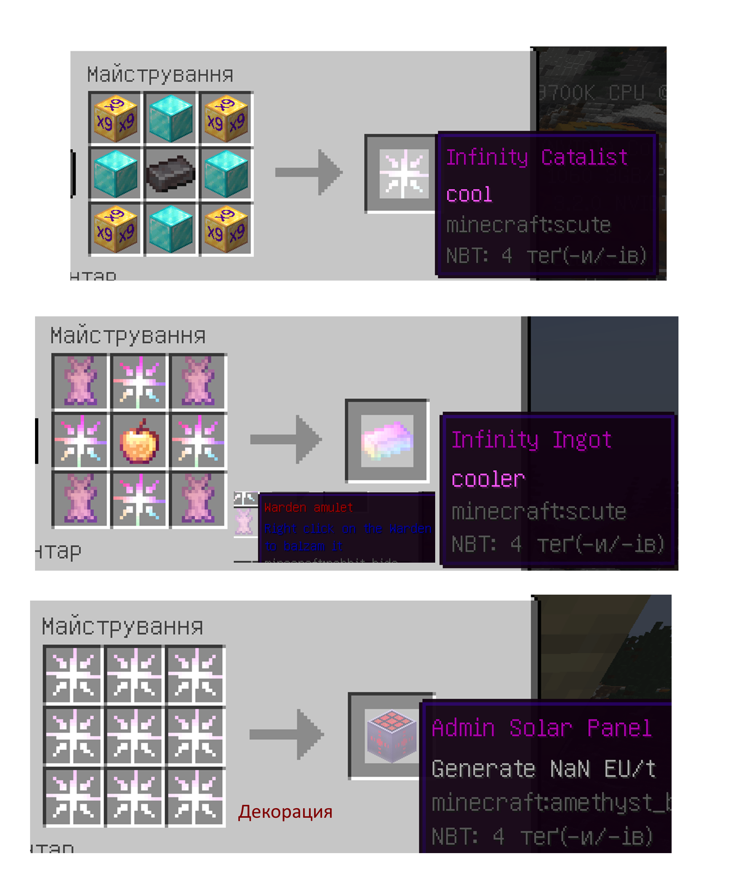
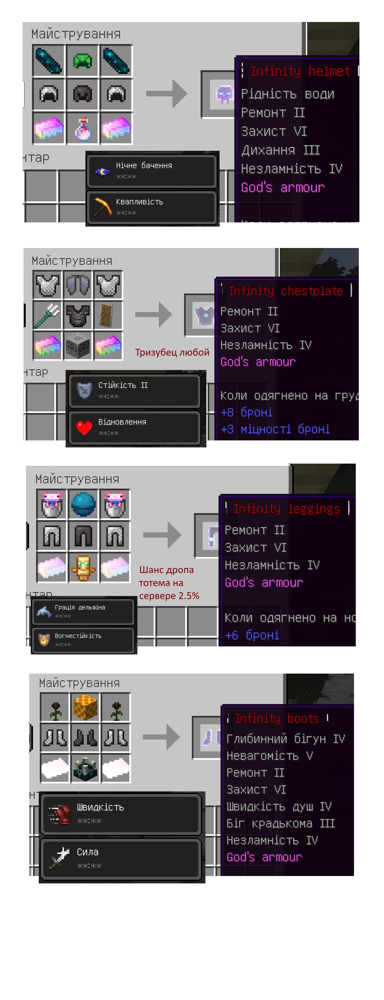

  

<h1 align="center">Установка І настройка Майнкрафту</h1>

___

## Зміст

[1. CustomTextures](#a1)

[2. ThiefPlugin](#a2)

[3. CustomSounds](#a3)

[4. BalzamingMobs](#a4)

[5. CustomCrafts](#a5)

[5.1 Infinity Set](#a6)

## 1. CustomTextures
Речі можна отримати при вииграші в івентах

`Тутор напишу, ближе до івентів`

## 2. ThiefPlugin
Речі можна отримати при вииграші в івентах

`Тутор напишу, ближе до івентів`

## 3. CustomSounds
Речі можна отримати при вииграші в івентах

`Тутор напишу, ближе до івентів`

## 4. BalzamingMobs

 - За допомогою цього плагіну ви зможете бальзамувати мобів. 
  Для цього ми Спочатку крафтимо пустий шприц:

 - Тепер ми повинні набрати магічної жижки з серця Вардену. Для цього ми
  клікаємо ПКМ по Вардену, щоб наповнити шприц жижкой.

 - **Примітка**: Якщо Варден забальзамований, то його не можна використовувати в таких цілях

 - Тепер ми отримали шприц, який можна використовувати. Якщо таким шприцом ми нажмемо по мобу, то цей моб
забальзамується, то він не зможе ходити, атакувати, отримувати урон тощо, і зверху з'явиться зелене слово `Balzamed`.
Якщо ж клікнути по цьому мобу лазуритом, то бальзамація пройде, і моб стане таким, як і був до цього.

- **Примітка**: Можна забальзамувати всіх, крім ендер-дракона, візера і самого Вардена.

 - Якщо ж ми хочемо забальзамувати Вардена, то нам потрібно зробити для цього амулет:

`Цей амулет придумали шамани і Юку, сидя в печері. Він діє лише на Вардена, а також подейкують, що його
використовують в крафті броні Богів.`

## 5. CustomCrafts

Ось основні крафти, які цей плагін додає:

## 5.1 Infinity Set

**Примітка**: Для крафту Інфініті сету потрібні речі з плагіну `BalzamingMobs` 

[(Посилання на плагін)](#a10)

**Примітка**: Для нормального відображення Інфініту Сету потрібен `OptiFine`

**Примітка**: Інфініті сет, при надіванні, дає постійні ефекти своєму господареві, про які буде розписано потім.

