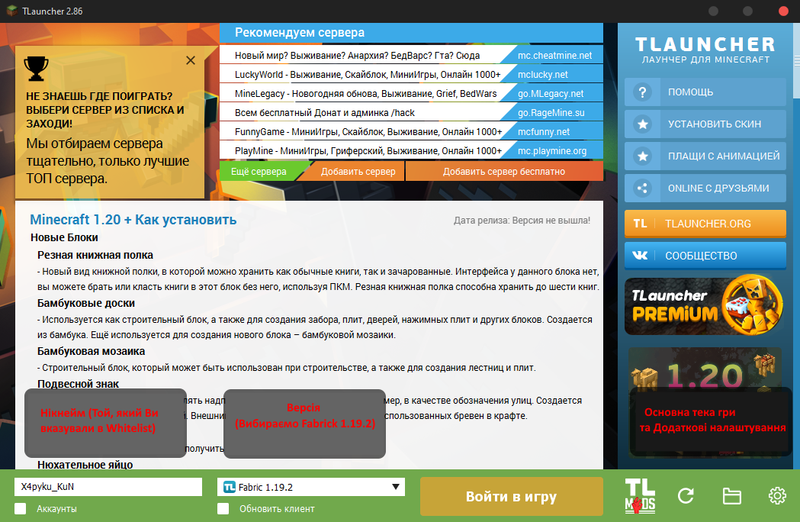
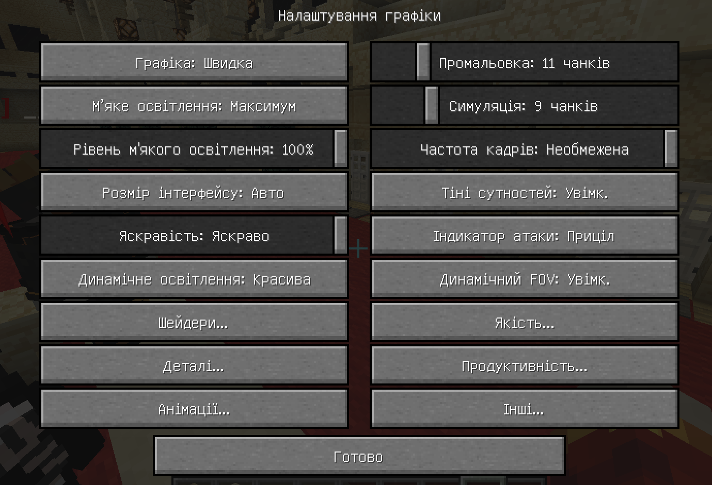
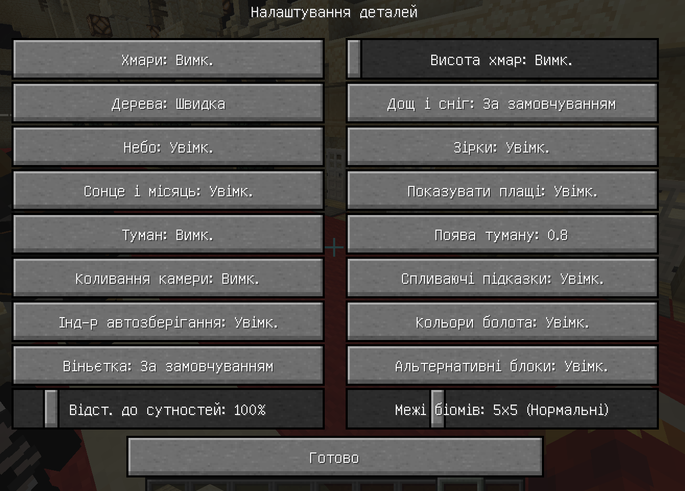
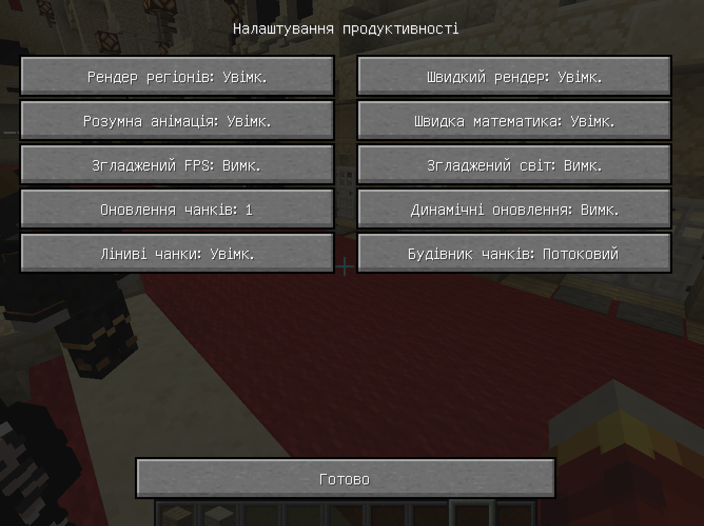
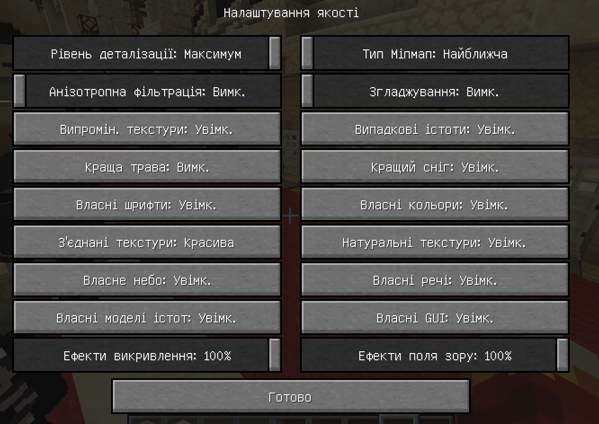

  

<h1 align="center">Установка І настройка Майнкрафту</h1>

___

## Зміст

[1. Скачування лаунчера](#a1)

[2. Скачування Оптіфайну](#a2)

[3. Оптимізація Майнкрафту (.-.)](#a3)

## 1. Скачування лаунчера
___
### 1.2 Скачування Піратки

Заходимо на сайт [Tlauncher](https://tlauncher.org/) . Звідки скачуємо інсталятор і запускаємо.
Основні налаштування TLauncher'a:

Переходимо в Додаткові налаштування (справа знизу шестерня) Та внизу виставляємо
повзунком Об'єм виділеної оперативної пам'яті. 

**Порада:** Ставте Оперативну Пам'ять, але не більше, ніж у Вас є відняти 3 ГБ.
Наприклад, у Вас стоїть 16 ГБ => на майн максимально можна буде виділити 13 ГБ.

## 2. Скачування Оптіфайну
___

Переходимо за посиланням, і скачуємо 2 файли для Оптіфайну. 

### 3. Оптимізація Майнкрафту
___
`Якщо ви вже Матьорий Юзер майнкрафту, то цей пункт можна пропускати  `

Заходимо ESC => параметри => Налаштування графіки. Опиняємося в такому меню:

Тепер пройдемося по Основним вкладкам:

### Деталі:

### Продуктивність:

### Анімація:

` Якщо у Вас не найсильніше залізо, то виключаємо все в цьому пунктці
(Всі Вимкю). В іншому випадку, тут все ставимо на свій смак 
(Цей пункт сильно впливає на продуктивність)`

### Якість:

